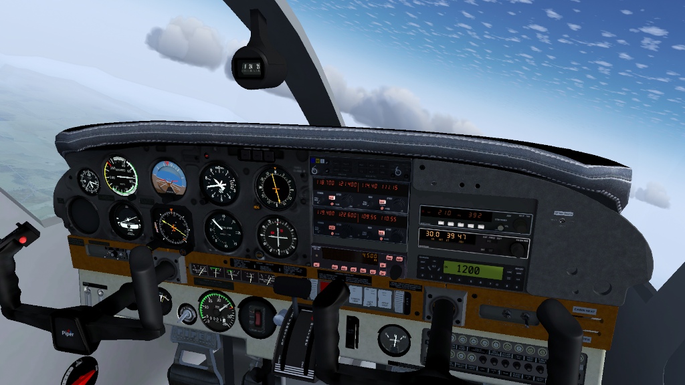
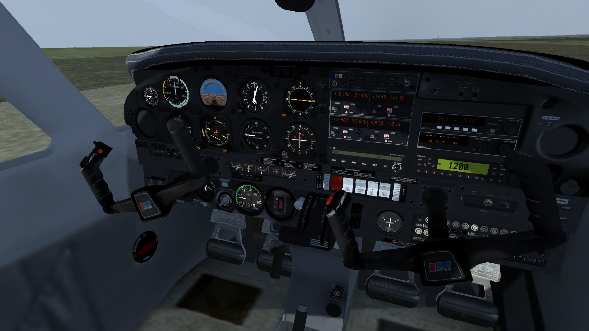

# Flightgear PA28 Warrior II new livery

An alternative livery with weathering textures, and a new panel texture for the Flightgear open flight simulator's "PA28" Warrior. Original plane from .

Piper Pa-28-181 Warrior II new livery

c.2004 panel.

With Garmin G5 and s-Tex 55x autopilot

Traditional leather panel

